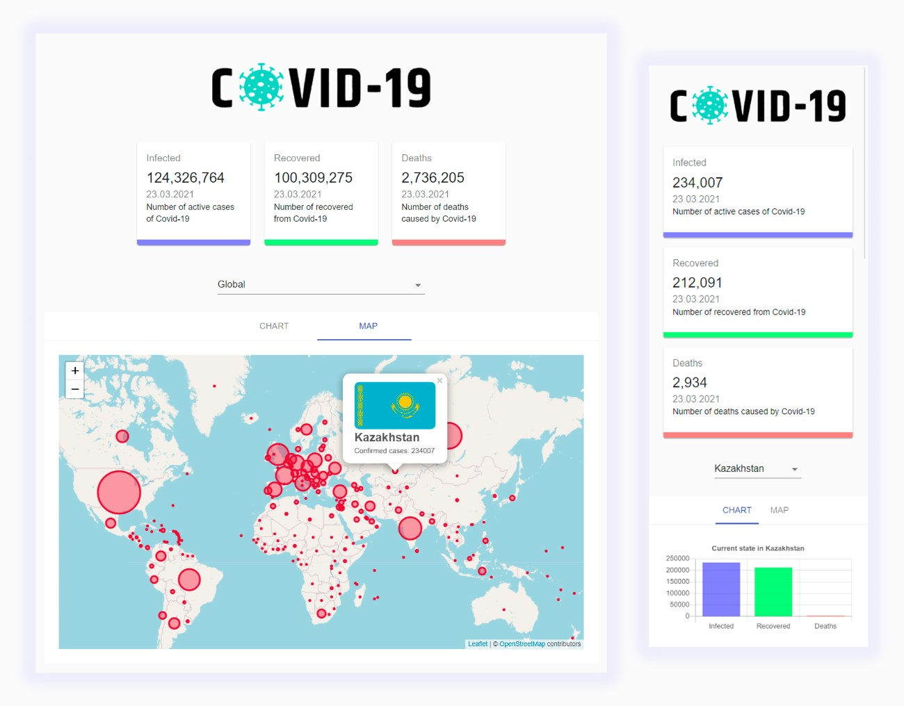

# COVID-19 Tracker

This is a simple React application showing the number of confirmed cases of the disease, recovered and died from covid-19. Built on [API](https://covid19.mathdro.id/api) by [mathdroid](https://github.com/mathdroid). 

This serverless application at startup fetch data from API and builds a chart on the received information about the situation with the covid-19 in the world. After that, you can select a country and you will be shown the information in that country.